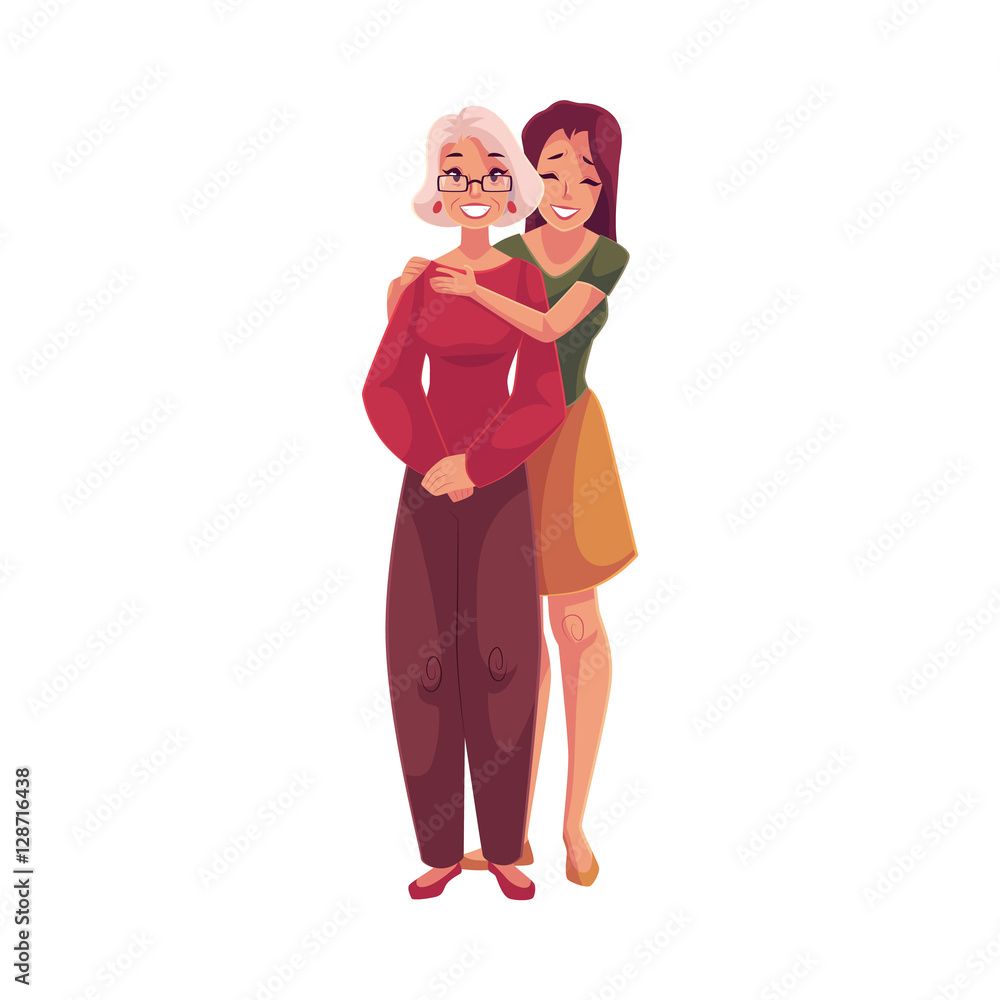
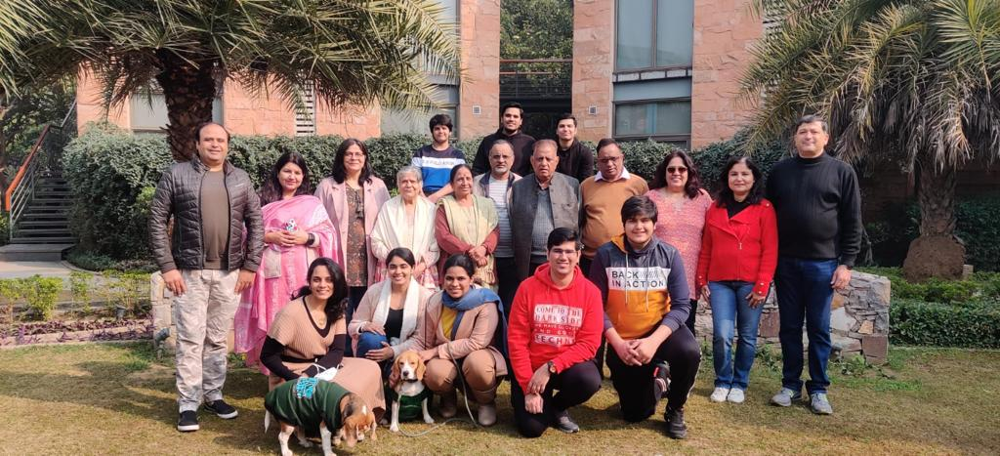
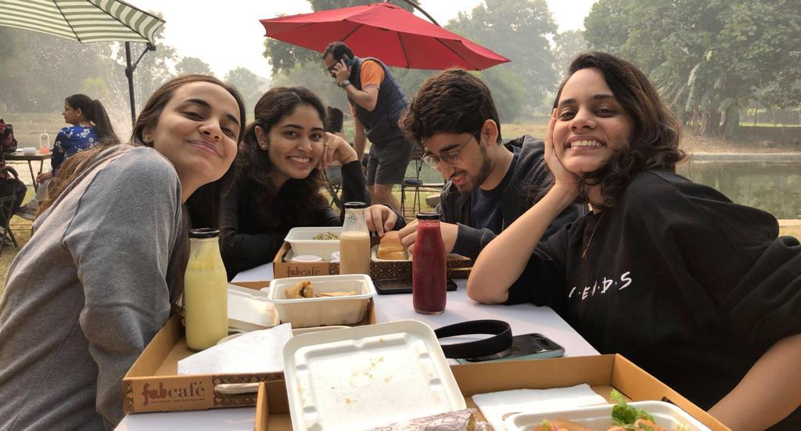

```{r, out.width = "300px", warning=FALSE, message=FALSE,echo=FALSE}

```

[Image Source](https://stock.adobe.com/images/young-beautiful-granddaughter-hugging-grandmother-cartoon-vector-illustration-isolated-on-white-background-full-length-portrait-of-young-woman-hugging-her-grandma-family-connection/128716438)
 
<span style="font-weight:bold;">This report is inspired from a conversation between me and my grandmother:</span>
 
During a scorching New York summer, I chatted with my grandmother in India over the phone. Our conversation turned to her upcoming birthday, and she expressed a desire for family to be near her. She believed that being together was the greatest gift as it makes her the most happy.

This struck me because I typically celebrated birthdays with friends, seeking adventure and excitement. The contrast in what made us happy intrigued me. May be it is because of our age gap, or maybe our marital statuses that she values family more than I do, who knows? Let's check!

### Part A: What makes people of different ages happy?

We're going to break age groups down in three categories:

1. Adulthood Group (20 - 39 years)

2. Middle Adulthood Group (40 - 59 years)

3. Old Age Group (60+ years)

```{r, warning=FALSE, message=FALSE,echo=FALSE}
knitr::opts_chunk$set(echo = TRUE)
```

```{r, message=FALSE, warning=FALSE, echo=FALSE}
library(tm)
library(tidytext)
library(tidyverse)
library(DT)
library(wordcloud)
library(ggwordcloud)
library(scales)
library(gridExtra)
library(ngram)
library(shiny)
library(egg)
```

```{r read data, warning=FALSE, message=FALSE, echo=FALSE}
urlfile <- 'https://raw.githubusercontent.com/rit-public/HappyDB/master/happydb/data/cleaned_hm.csv'
hm_data <- read_csv(urlfile)
```

```{r text processing in tm, warning=FALSE, message=FALSE, echo=FALSE}
corpus <- VCorpus(VectorSource(hm_data$cleaned_hm))%>%
  tm_map(content_transformer(tolower))%>%
  tm_map(removePunctuation)%>%
  tm_map(removeNumbers)%>%
  tm_map(removeWords, character(0))%>%
  tm_map(stripWhitespace)
```

```{r stemming, warning=FALSE, message=FALSE, echo=FALSE}
stemmed <- tm_map(corpus, stemDocument) %>%
  tidy() %>%
  select(text)
```

```{r tidy dictionary, warning=FALSE, message=FALSE, echo=FALSE}
dict <- tidy(corpus) %>%
  select(text) %>%
  unnest_tokens(dictionary, text)
```

```{r stopwords, warning=FALSE, message=FALSE, echo=FALSE}
data("stop_words")

word <- c("happy","ago","yesterday","lot","today","months","month",
                 "happier","happiest","last","week","past","day","time")

stop_words <- stop_words %>%
  bind_rows(mutate(tibble(word), lexicon = "updated"))
```

```{r tidy stems with dictionary, warning=FALSE, message=FALSE, echo=FALSE}
completed <- stemmed %>%
  mutate(id = row_number()) %>%
  unnest_tokens(stems, text) %>%
  bind_cols(dict) %>%
  anti_join(stop_words, by = c("dictionary" = "word"))
```

```{r stem completion, warning=FALSE, message=FALSE, echo=FALSE}
completed <- completed %>%
  group_by(stems) %>%
  count(dictionary) %>%
  mutate(word = dictionary[which.max(n)]) %>%
  ungroup() %>%
  select(stems, word) %>%
  distinct() %>%
  right_join(completed) %>%
  select(-stems)
```

```{r reverse unnest, warning=FALSE, message=FALSE, echo=FALSE}
completed <- completed %>%
  group_by(id) %>%
  summarise(text = str_c(word, collapse = " ")) %>%
  ungroup()
```

```{r cleaned hm_data, warning=FALSE, message=FALSE, echo=FALSE}
hm_data <- hm_data %>%
  mutate(id = row_number()) %>%
  inner_join(completed)
```

```{r export data, warning=FALSE, message=FALSE, echo=FALSE}
write_csv(hm_data, "../output/processed_moments.csv")  
```
 
<span style="font-weight:bold;">Lets get started with the analysis!!</span>
  
I started with the original data 'cleaned_hm.csv' (from https://github.com/megagonlabs/HappyDB/blob/master/happydb/data/cleaned_hm.csv) that needed to be cleaned and processed before it is ready for analysis. Then, I applied techniques such as lower casing letters, removing punctuations and extra spaces, stemming the words, and making id for each happy moment. This final data  'processed_moments.csv' is stored in the output folder.

I now join this processed text with the demographic data 'demographic.csv' (from https://github.com/megagonlabs/HappyDB/blob/master/happydb/data/demographic.csv) and select a subset of the combined data satisfying specific row conditions.
 
```{r load data, message=FALSE, warning=FALSE, echo=FALSE}
hm_data <- read_csv("../output/processed_moments.csv")

urlfile<-'https://raw.githubusercontent.com/rit-public/HappyDB/master/happydb/data/demographic.csv'
demo_data <- read_csv(urlfile)
```

```{r combining data, message=FALSE, warning=FALSE, echo=FALSE}
hm_data <- hm_data %>%
  inner_join(demo_data, by = "wid") %>%
  select(wid,
         original_hm,
         gender, 
         marital, 
         parenthood,
         reflection_period,
         age, 
         country, 
         ground_truth_category, 
         predicted_category,
         text) %>%
  mutate(count = sapply(hm_data$text, wordcount)) %>%
  filter(gender %in% c("m", "f")) %>%
  filter(marital %in% c("single", "married","divorced","separated","widowed")) %>%
  filter(parenthood %in% c("n", "y")) %>%
  filter(reflection_period %in% c("24h", "3m")) %>%
  mutate(reflection_period = fct_recode(reflection_period, 
                                        months_3 = "3m", hours_24 = "24h"))
```

#### Question 1: What makes Adulthood Aged (20 - 39 years) people happy?

```{r adulthood, warning=FALSE, message=FALSE, echo=FALSE}
adulthood_data <- filter(hm_data, age %in% (20:39))
bag_of_words_adulthood <-  adulthood_data %>%
  unnest_tokens(word, text)

word_count <- bag_of_words_adulthood %>%
  count(word, sort = TRUE)
set.seed(1)

p1 <- ggplot(word_count[1:10,], aes(label = word, size = n, color = n)) +
              geom_text_wordcloud_area() +
              scale_size_area(max_size = 10) +
              theme_minimal() +
              scale_color_gradient(low = "royalblue3", high = "navy")

p2 <- word_count[1:10,] %>%
              mutate(word = reorder(word, n)) %>%
              ggplot(aes(word, n, fill = n)) +
              scale_fill_gradient(low = "skyblue", high = "royalblue3") +
              geom_col() +
              labs(title = "Word Frequency in Happy Moments for Adulthood (20 - 39 years) Group")+
              xlab(NULL) +
              ylab("Word Frequency")+
              coord_flip()

ggarrange(p1, p2, ncol = 2)
``` 

#### Question 2: What makes Middle Adulthood Aged (40 - 59 years) people happy?

```{r middle adulthood, warning=FALSE, message=FALSE, echo=FALSE}
middle_adulthood_data <- filter(hm_data, age %in% (40:59))
bag_of_words_middle_adulthood <-  middle_adulthood_data %>%
  unnest_tokens(word, text)

word_count <- bag_of_words_middle_adulthood %>%
  count(word, sort = TRUE)
set.seed(1)

p1 <- ggplot(word_count[1:10,], aes(label = word, size = n, color = n)) +
              geom_text_wordcloud_area() +
              scale_size_area(max_size = 10) +
              theme_minimal() +
              scale_color_gradient(low = "pink2", high = "darkmagenta")

p2 <- word_count[1:10,] %>%
              mutate(word = reorder(word, n)) %>%
              ggplot(aes(word, n, fill = n)) +
              scale_fill_gradient(low = "plum", high = "mediumpurple") +
              geom_col() +
              labs(title = "Word Frequency in Happy Moments for Middle Adulthood (40 - 59 years) Group")+
              xlab(NULL) +
              ylab("Word Frequency")+
              coord_flip()

ggarrange(p1, p2, ncol = 2)
```

#### Question 3: What makes Old Age (60+ years) people happy?

```{r old age, warning=FALSE, message=FALSE, echo=FALSE}
old_age_data <- filter(hm_data, age %in% (60:100))
bag_of_words_old_age <-  old_age_data %>%
  unnest_tokens(word, text)

word_count <- bag_of_words_old_age %>%
  count(word, sort = TRUE)
set.seed(1)

p1 <- ggplot(word_count[1:10,], aes(label = word, size = n, color = n)) +
              geom_text_wordcloud_area() +
              scale_size_area(max_size = 10) +
              theme_minimal() +
              scale_color_gradient(low = "palegreen", high = "darkgreen")

p2 <- word_count[1:10,] %>%
              mutate(word = reorder(word, n)) %>%
              ggplot(aes(word, n, fill = n)) +
              scale_fill_gradient(low = "seagreen2", high = "springgreen4") +
              geom_col() +
              labs(title = "Word Frequency in Happy Moments for Old Age (60+ years) Group")+
              xlab(NULL) +
              ylab("Word Frequency")+
              coord_flip()

ggarrange(p1, p2, ncol = 2)
``` 
 
<span style="font-weight:bold;">Inference:</span>

1. For Adulthood group, their friends make them the most happy. Everything else including family and home is secondary to them, since the frequency of friends is drastically higher than the frequency of other happy moments.

2. For Middle Adulthood group and Old Age group, their happiness revolves around not just their friends, but also their home, wife/husband, sons/daughters. Clearly, the frequencies of friend and other happy moments (such as daughter, son, wife, husband,home) is much closer that proves these two groups of people get great happiness from home and loved ones as well. This tells us that as we grow up, we find ourselves more and more happy when we're around our family and loved ones, which we do not feel when we're young. 


<span style="font-weight:bold;color: PaleVioletRed;">Friends take the maximum space in any age as they are the ones close by and most readily available. And also that they are usually of the same age group so share a similar frequency of thoughts. But the fact is that the monopoly of friends in Adulthood Group is slowly replaced by relations and family as we grow older and enter the Middle Adulthood group and Old Age group. As we mature, we get more conscious and dependent on our children and spouses. And on a lighter note, the word daughter has a little edge over son at all times! Haha!!</span>


```{r, out.width = "600px", warning=FALSE, message=FALSE,echo=FALSE}

```


### Part B: What makes people of different Marital Statuses happy?

We're going to break Marital Statuses down in three categories:

1. Single

2. Married

3. Divorced/ Separated/ Widowed

```{r single, warning=FALSE, message=FALSE, echo=FALSE}
single_data <- filter(hm_data, marital %in% "single")

word_count <-  single_data %>%
  unnest_tokens(word, text) %>%
  count(word, sort = TRUE)

word_count[1:10,] %>%
      mutate(word = reorder(word, n)) %>%
      ggplot(aes(word, n, fill = n)) +
      scale_fill_gradient(low = "lightcoral", high = "mediumpurple") +
      geom_col() +
      labs(title = "Word Frequency in Happy Moments for Single people")+
      xlab(NULL) +
      ylab("Word Frequency")+
      coord_flip()
```

```{r married, warning=FALSE, message=FALSE, echo=FALSE}
married_data <- filter(hm_data, marital %in% "married")
otherstatus_data <- filter(hm_data, marital %in% c("divorced","separated","widowed"))

word_count <-  married_data %>%
  unnest_tokens(word, text) %>%
  count(word, sort = TRUE)

word_count[1:10,] %>%
      mutate(word = reorder(word, n)) %>%
      ggplot(aes(word, n, fill = n)) +
      scale_fill_gradient(low = "lightcoral", high = "mediumpurple") +
      geom_col() +
      labs(title = "Word Frequency in Happy Moments for Married people")+
      xlab(NULL) +
      ylab("Word Frequency")+
      coord_flip()
```

```{r dsw, warning=FALSE, message=FALSE, echo=FALSE}
married_data <- filter(hm_data, marital %in% "married")
otherstatus_data <- filter(hm_data, marital %in% c("divorced","separated","widowed"))

word_count <-  otherstatus_data %>%
  unnest_tokens(word, text) %>%
  count(word, sort = TRUE)

word_count[1:10,] %>%
      mutate(word = reorder(word, n)) %>%
      ggplot(aes(word, n, fill = n)) +
      scale_fill_gradient(low = "lightcoral", high = "mediumpurple") +
      geom_col() +
      labs(title = "Word Frequency in Happy Moments for Divorced/Separated/Widowed people")+
      xlab(NULL) +
      ylab("Word Frequency")+
      coord_flip()
```

<span style="font-weight:bold;">Inference:</span>

Single people get their most happiness from their Friends. After a huge gap in the frequency bar graph, we see other reasons for their happy moments are watching, playing, game, then comes family. Whereas for married people, besides friends their loved ones (kids and spouses) hold high frequency in making them happy. Interestingly, people whose marriage did not work (i.e. those who are divorced, separated, or widowed), besides friends, their majority happy moments come from their sons and daughters. 

<span style="font-weight:bold;">Conclusion:</span>

After analyzing a large variety of groups, divided by both age and their marital status, it is proven that Friends are Human's biggest source of happiness in all phases of life. As people grow mature, they realize the value of their family and loved ones. 

<span style="color: GoldenRod;font-weight:bold;">This proves that my grandmother was indeed correct when she said that family makes her the most happy. This is also an eye opener for me, and has now taught me to value my family and loved ones more than I usually do.</span>

<span style="color: PaleVioletRed;font-weight:bold;">P.S. I flew to India to be with her on her birthday! <3 </span>

## <span style="color: maroon;">To sum it all, in beautiful words written by John C. Maxwell, “Family and friendships are two of the greatest facilitators of happiness.”</span>

```{r, out.width = "600px", warning=FALSE, message=FALSE,echo=FALSE}

```
